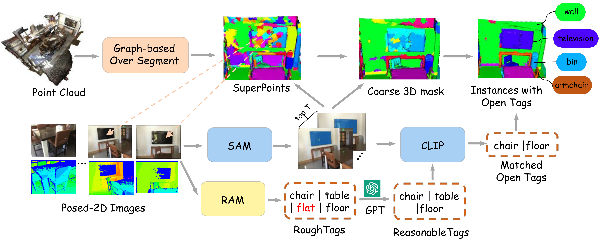
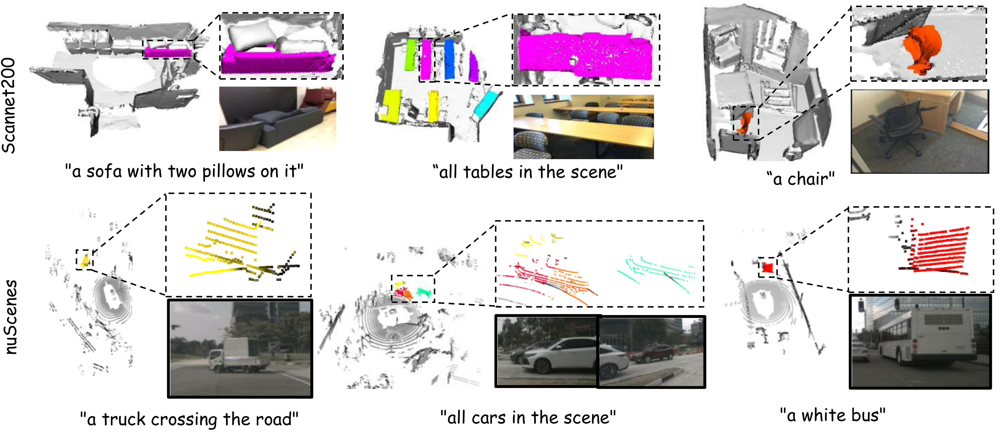

# OV-SAM3D
Open-Vocabulary SAM3D: Towards Training-free Open-Vocabulary 3D Scene Understanding  
[](https://arxiv.org/abs/2405.15580) [](https://hithqd.github.io/projects/OV-SAM3D/)  

## Overview
We present OV-SAM3D, a universal framework for open-vocabulary 3D scene understanding, capable of understanding any 3D scenes without prior knowledge. Our approach innovatively employs superpoints to generate initial coarse 3D masks via back-projection from the Segment Anything Model (SAM), which are subsequently refined and merged using filtered open tags and a specially designed overlapping score algorithm. 
  

## Installation
Here we recommend using the Docker environment as follows：
```
cd docker
docker build --network=host -t ovsam3d:v1 .
bash ./run_docker.sh
```
After creating a Docker container, clone the repository into the container:
```
docker exec -it container_id bash
cd /path/to/workspace/OV-SAM3D
pip install -e .
```
## Usage
Firstly, generate coarse 3D masks based on superpoints:
```
cd ovsam3d
python tools/generate_coarse_masks.py
data.scans_path=/path/to/ScanNet/scans 
data.label_path=/path/to/ScanNet/scannet200_text 
data.superpoints.top_num=100 
output.output_mask=/path/to/output/ovsam3d/scannet200/masks 
output.output_feature=/path/to/output/ovsam3d/scannet200/mask_features 
external.sam_checkpoint=/path/to/workspace/OV-SAM3D/sam_checkpoints/sam_vit_h_4b8939.pth 
```

Then further generate refined 3D instance masks:
```
python refine_masks.py 
data.scans_path=/path/to/ScanNet/scans 
data.label_path=/path/to/ScanNet/scannet200_text 
output.output_feature=/path/to/output/ovsam3d/scannet200/mask_features  
output.output_mask=/path/to/output/ovsam3d/scannet200/masks
```
## Evaluation
Our method for evaluating models is consistent with OpenMask3D:
```
cd ovsam3d/evaluate
python evaluate_on_close_set.py 
--gt_dir=/path/to/ScanNet/processed/instance_gt/validation 
--mask_pred_dir=/path/to/output/ovsam3d/scannet200/masks
--mask_features_dir=/path/to/output/ovsam3d/scannet200/mask_features
```
## Results
